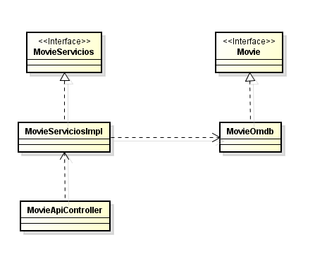

### Escuela Colombiana de Ingeniería
### Arquitecturas de Software - ARSW
### Taller de recuperaci+on

Link a Heroku: https://omdba.herokuapp.com/ 

Esta aplicación se basa en un cliente web en javascript asíncrono el cual se conecta mediante http a un rest api 
desplegado en heroku, solicitando la informacion de una pelicula, dados su titulo y año de estreno, el rest api
en heroku; a su vez, se conecta a un api externo, para este caso se tomó el api gratuito "omdbapi.com", el cual
devuelve a la aplicación, toda la informacion de la pelicula en formato JSON, el cliente web usa  servicios REST 
desplegados en Heroku y use Json como formato para los mensajes, todos los protocolos de comunicación fueron
implementados sobre HTTP y la aplicación usa maven para gestionar el ciclo de vida,asi como github para almacenar 
el código fuente.

El siguiente diagrama muestra brevemente una arquitectura usada para el desarrollo de la aplicación:

Esta arquitectura se basa en MVC, modelo- vista - controlador de la siguiente manera:

De acuerdo al modelo anterior, un controlador se encarga de gestionar los servicios 
que ofrece una Api (Omdb Api) y para esto usé inyeccion de dependencias en caso de que 
se quisiera conectar a otra Api, que junto con su interfaz Movie permitiria conectarla
de modo que la aplicación sea escalable. 
